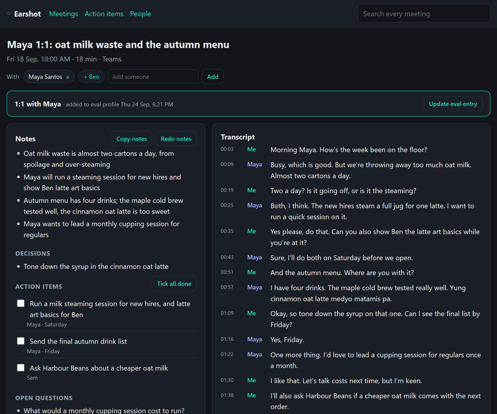

# Earshot

A local meeting note-taker for Windows. It records a call from the laptop itself, so no bot joins the meeting. It then transcribes the call offline and writes notes with a local LLM. Nothing leaves the machine.



The sample data is fictional: Sam Carter runs a small roastery and café, Ember & Oak Coffee, and has calls with the team and suppliers.

## What it does

- **Records without joining.** It records the mic as a "Me" track and the laptop's speaker output (WASAPI loopback) as a "Them" track. Any call app works: Teams, Zoom, Meet in a browser.
- **Notices calls by itself.** Windows logs which app is using the mic, and Earshot watches that. When a call app starts, a pop-up asks *Record this call?* When the app lets go of the mic, the recording stops.
- **Knows who the call is with.** It reads the Teams call window's title and tags the person. Only a window that opened with the call counts, never the main window, which shows whatever chat happens to be open.
- **Transcribes offline** with faster-whisper (`small`, int8, CPU). A names list steers Whisper towards the right spelling of people and jargon. It handles English/Tagalog code-switching (Taglish).
- **Cleans the transcript.** It drops Whisper's hallucinations (a phrase looped over silence) and *speaker bleed*: on a laptop speaker the mic hears the other person too. See [evals](#evals).
- **Writes notes with a local LLM** (Ollama, `qwen2.5:7b`), structured as JSON: title, summary, decisions, action items with owners and due dates, and open questions. Long calls are summarised in chunks and merged.
- **Keeps a profile per person.** Each profile collects what they're working on, what they raised, what they said they'd do, and their open action items across calls.
- **1:1 support.** A 1:1 with a direct report is logged to their markdown development profile automatically. A **prep sheet** before the next 1:1 lists what each side owes, what they raised since the last one, their goals, and suggested topics.
- **Action items that don't get lost.** "Friday", "tomorrow" and "Oct 1" become real dates. The actions page is grouped by overdue, today and this week, and a weekday-morning tray reminder lists what's due.
- **Works from Claude Code.** An MCP server (`mcp_server.py`) lets an assistant find calls, read transcripts, search who said what, tick action items, correct the notes, and build a prep sheet.

## Evals

Two parts of the pipeline are tested with numbers, not a quick look.

**Speaker bleed.** Without headphones, the mic picks up the other person through the laptop speaker, so their words turn up again as "Me". Word matching can't catch it reliably, because the two copies get transcribed differently (especially in Taglish). Earshot compares *loudness* instead. During bleed, the mic's loudness follows the call audio's loudness about half a second later, so a high correlation at some delay means bleed.

`evals/bleed_eval.py` builds labelled cases with two synthetic voices. Each case is bleed only, real speech over the other person, or real speech alone. It runs them under harder and harder conditions:

| Condition | Bleed caught | Real speech wrongly dropped |
|---|---|---|
| Typical laptop speaker | 16/16 | 0/32 |
| He talks softly | 15/16 | 0/32 |
| Quiet bleed | 1/16 | 0/32 |
| Noisy room | 0/16 | 0/32 |

The rule never drops real speech. That's the costly mistake, because your own words vanish from the notes. When the bleed is very quiet or the room is noisy, it lets bleed through instead, and a word-matching backup gets a second try. The rule flags a line as bleed when the correlation is above 0.6.

The eval also caught a bad idea. Smoothing the loudness curves looked like a way to catch the quiet cases. It lifted overlapping real speech above the threshold and started dropping it (9 of 32 lines at the widest setting), so it was rejected.

**The unit suite** (`tests/qa_unit.py`, 33 tests) runs every module against a throwaway database, with Whisper and Ollama stubbed. It covers owner attribution, bleed and hallucination filters, recovery after a crash, date parsing, auto-tagging, the web routes and the MCP tools. It also proves the run left the sample profiles untouched.

## Run it

Windows 10 or 11, Python 3.12 or newer, and [Ollama](https://ollama.com) with `ollama pull qwen2.5:7b`.

```
pip install -r requirements.txt
python demo\seed.py      # five made-up café calls, so every page has something to show
run.bat                  # tray icon + http://127.0.0.1:5175
python tests\qa_unit.py
python evals\bleed_eval.py
```

Start a recording from the page or the tray icon, or let the pop-up ask when a call starts. Put your own names and jargon in `VOCAB` in `config.py`, and your people in `PEOPLE_SEED`.

To use it from Claude Code: `claude mcp add earshot -- python C:\path\to\earshot\mcp_server.py`

## How it's built

| Part | File |
|---|---|
| Two-track capture (mic + WASAPI loopback, with a silent keep-alive so the loopback clock keeps running) | `recorder.py` |
| Transcribe, drop hallucinations and bleed, Opus audio, the job queue, 30-day audio purge | `pipeline.py` |
| Local LLM notes with a JSON schema, streamed so a stalled model is noticed, one automatic Ollama restart | `summarise.py` |
| Saving notes, promises turned into action items, owner fixing ("can you..." from them means Sam owns it) | `notes.py` |
| Call detection from the registry, auto-stop | `detect.py` |
| Who the call is with, from the Teams call window | `callwho.py` |
| People and profiles; 1:1 log to markdown; prep sheet | `people.py`, `evals.py`, `prep.py` |
| Due dates and reminders | `dues.py` |
| Web UI (Flask + Jinja), tray icon (pystray) | `web.py`, `earshot.py` |
| MCP server | `mcp_server.py` |

The private version also imports Teams chats (a weekly pull, so 1:1 chats feed the same profiles). That part was built around one company's Teams setup, so it's left out here; the database tables and the "Teams chats" tab remain but stay empty.

SQLite in WAL mode, with full-text search over transcripts. Audio is kept 30 days, and transcripts and notes are kept for good. More on the design choices and what went wrong along the way: [docs/how-it-works.md](docs/how-it-works.md).

## License

MIT
